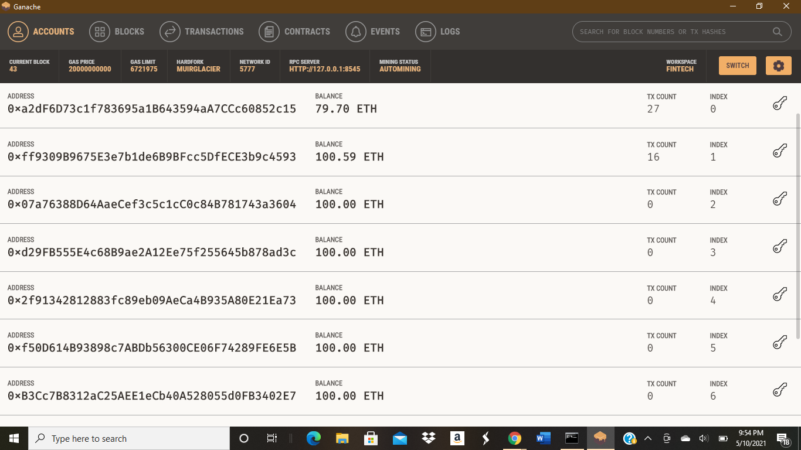
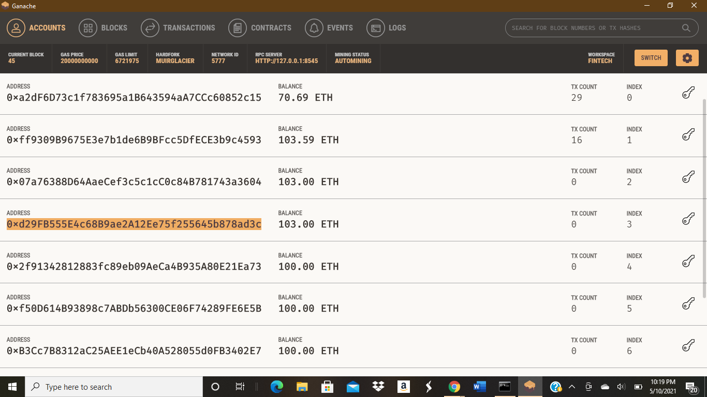

# Solidity Contracts

### Associate Profit Splitter Contract
---
This contract allows the person deploying the contract to transfer funds from their wallet into three other wallets simultaneously. It also splits the tranfer amount in three, evenly depositing the amount into the three previously designated accounts.
After testing it on the local blockchain I deployed it on the Ropsten test network. The contract address is 0xa7cc9199ce9F71B36739A87068312E65Dd31C67C. The contract deployer wallet address is 0xa2dF6D73c1f783695a1B643594aA7CCc60852c15

### Deployment Tutorial

#### Values Before Transaction

#### Values Post Transaction (Sent 9 Ether)

